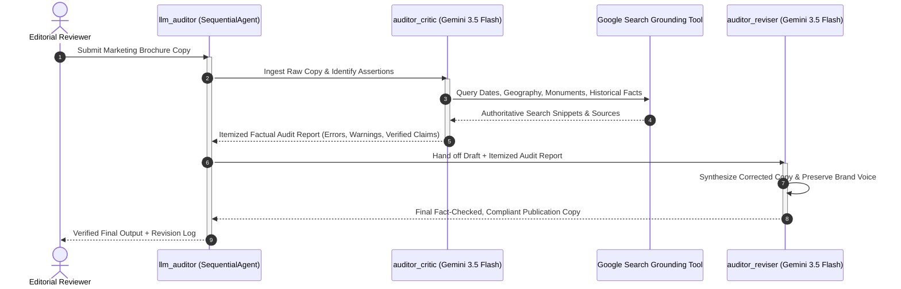

# Autonomous Content Auditor & Fact-Checking Engine

[](https://www.python.org/)
[](https://cloud.google.com/vertex-ai)
[](https://github.com/google/adk-python)
[](https://docs.pydantic.dev/)
[](https://conventionalcommits.org)
[](https://opensource.org/licenses/Apache-2.0)

> An enterprise-grade, multi-agent editorial pipeline and fact-checking engine built on the **Google Agent Development Kit (ADK)**, **Vertex AI (Gemini 3.5 Flash)**, **Pydantic v2**, and **Google Search Tool Grounding**. Designed to autonomously detect factual errors, verify geographic invariants, and rewrite promotional collateral into full compliance.

---

## 🏛️ System Architecture

The repository comprises three specialized agent modules organized into single-task and multi-agent sequential workflows:

```
                                [ CLIENT / USER ]
                                        │
           ┌────────────────────────────┼────────────────────────────┐
           │                            │                            │
           ▼                            ▼                            ▼
┌──────────────────────┐     ┌──────────────────────┐     ┌──────────────────────┐
│my_google_search_agent│     │    geo_validator     │     │     llm_auditor      │
│   (Travel Scout)     │     │(Destination Verifier)│     │  (SequentialAgent)   │
│                      │     │                      │     │                      │
│ - Gemini 3.5 Flash   │     │ - Gemini 3.5 Flash   │     │  Stage 1: critic     │
│ - native google_search│    │ - CountryCapital     │     │   - Google Search    │
│   grounding tool     │     │   (Pydantic v2)      │     │   - Claim extraction │
│ - Real-time scouting │     │ - disallow_transfer  │     │          │           │
└──────────────────────┘     └──────────────────────┘     │          ▼           │
                                                          │  Stage 2: reviser    │
                                                          │   - Factual rewrite  │
                                                          │   - Tone compliance  │
                                                          └──────────────────────┘
```

### Multi-Agent Pipeline Sequence (Mermaid)



---

## 🧩 Agent Specifications

### 1. `my_google_search_agent` (Travel Scout)
- **Path**: `my_google_search_agent/agent.py`
- **Model**: `gemini-3.5-flash`
- **Tooling**: Built-in `google_search` tool from `google.adk.tools`.
- **Function**: Autonomously performs real-time web searches to scout upcoming cultural events, festivals, regional logistics, and seasonal attractions without hallucinated dates or closures.

### 2. `geo_validator` (Destination Verifier)
- **Path**: `geo_validator/agent.py`
- **Model**: `gemini-3.5-flash`
- **Contract**: Strictly enforces the Pydantic v2 `CountryCapital` model via `output_schema`.
- **Security & Flow Control**: Sets `disallow_transfer_to_parent=True` and `disallow_transfer_to_peers=True` for deterministic isolation, preventing the agent from delegating to other agents in the environment. ADK does not infer these from `output_schema`, so both are declared explicitly.

### 3. `llm_auditor` (Multi-Agent Editorial Pipeline)
- **Path**: `llm_auditor/agent.py`
- **Orchestrator**: `SequentialAgent` executing an atomic two-stage pipeline:
  1. `llm_auditor/critic/agent.py`: Extracts assertions, dates, prices, and locations, cross-verifying each via `google_search`.
  2. `llm_auditor/reviser/agent.py`: Ingests the critique and original draft to produce 100% compliant, polished marketing collateral.

---

## 📁 Repository Structure

```
autonomous-content-auditor-engine/
├── .env.example                   # Environment configuration template
├── .gitignore                     # Git rules for Python & ADK runtimes
├── LICENSE                        # Apache 2.0 open-source license
├── README.md                      # Architecture and operational documentation
├── pyproject.toml                 # Package definition and metadata
├── requirements.txt               # Locked dependencies
├── my_google_search_agent/
│   ├── __init__.py
│   └── agent.py                   # Travel scout with Google Search grounding
├── geo_validator/
│   ├── __init__.py
│   └── agent.py                   # Destination verifier with Pydantic v2 schema
├── llm_auditor/
│   ├── __init__.py
│   ├── agent.py                   # Root SequentialAgent coordinating pipeline
│   ├── critic/
│   │   ├── __init__.py
│   │   └── agent.py               # Fact-checking critic agent with search tool
│   └── reviser/
│       ├── __init__.py
│       └── agent.py               # Editorial synthesis reviser agent
├── samples/
│   └── brochure_sample.txt        # Unverified marketing copy for testing
├── tests/
│   └── test_agents.py             # Structural tests for agent loading and wiring
└── scripts/
    └── setup_env.sh               # Google Cloud Shell environment bootstrapping
```

---

## ⚙️ Configuration & Environment Variables

This project adheres to **zero-hardcoded credential principles**. All authentication is managed via Google Cloud **Application Default Credentials (ADC)** and Vertex AI enterprise APIs.

Copy `.env.example` to `.env` and configure your GCP environment:

```bash
cp .env.example .env
```

| Variable | Description | Default |
| :--- | :--- | :--- |
| `GOOGLE_GENAI_USE_VERTEXAI` | Enables Vertex AI backend for enterprise billing & quotas | `True` |
| `GOOGLE_CLOUD_PROJECT` | Target GCP Project ID | *Required* |
| `GOOGLE_CLOUD_LOCATION` | Region for Vertex AI Gemini API endpoint | `us-central1` |
| `MODEL_NAME` | Primary foundation model identifier | `gemini-3.5-flash` |
| `LOG_LEVEL` | Python application logging verbosity | `INFO` |

**Without a Google Cloud project**, the agents also run against the Gemini Developer API.
Set `GOOGLE_GENAI_USE_VERTEXAI=False` and `GOOGLE_API_KEY=<your key>` in `.env` instead of the
project variables; ADK loads `.env` automatically from the agent directory.

---

## 🚀 Quickstart & Setup

### 1. Prerequisites
- Python 3.11+
- Google Cloud SDK (`gcloud`) installed and authenticated
- Google Cloud Project with the **Vertex AI API** (`aiplatform.googleapis.com`) enabled

### 2. Local Environment Installation
```bash
# Clone the repository
git clone https://github.com/your-username/autonomous-content-auditor-engine.git
cd autonomous-content-auditor-engine

# Initialize virtual environment
python3 -m venv .venv
source .venv/bin/activate  # On Windows: .venv\Scripts\activate

# Install dependencies
pip install --upgrade pip
pip install -r requirements.txt

# Authenticate with Google Cloud Application Default Credentials
gcloud auth application-default login
```

### 3. Running the Tests

The suite is structural — it asserts the contracts ADK relies on to load and wire the
agents, so it needs no credentials and makes no model calls:

```bash
pip install -e ".[dev]"
pytest
```

---

## 🖥️ Execution Workflows (CLI & Web UI)

The Google Agent Development Kit provides native CLI and Web UI interfaces out of the box:

### Option A: Interactive Web UI Playground
Launch the ADK visual dashboard to inspect agent state transitions, tool call arguments, and search grounding metadata:

```bash
adk web
```
*Open your browser at `http://localhost:8000` (or the URL displayed in the terminal).*

### Option B: Command-Line Interface (CLI)

#### 1. Run the Travel Scout Agent
```bash
adk run my_google_search_agent "Find upcoming cultural festivals and exhibitions in Kyoto this autumn."
```

#### 2. Run the Geo Validator Agent
```bash
adk run geo_validator "Tell me the capital of Canada"
```
*Output (Strict JSON)*:
```json
{
  "country": "Canada",
  "capital": "Ottawa"
}
```

#### 3. Run the Full Sequential Auditor Pipeline
```bash
adk run llm_auditor < samples/brochure_sample.txt
```

---

## 🧪 Sample Audit Transformation

> [!NOTE]
> The exchange below illustrates the **expected shape** of each stage's output. It is
> not a recorded transcript, and live model output will differ in wording and ordering.
> Run `adk run llm_auditor < samples/brochure_sample.txt` to produce a real one.

### Input (Unverified Travel Copy)
The full draft lives in [`samples/brochure_sample.txt`](samples/brochure_sample.txt) and plants six
verifiable errors across history, geography, pricing and logistics.

### Stage 1 Output (`auditor_critic`)
```markdown
### Fact-Checking Audit Report
- [FACTUAL ERROR]: Eiffel Tower construction date is incorrect. Grounding indicates it was completed in 1889 for the Exposition Universelle, not 1912.
- [FACTUAL ERROR]: The Louvre is a national museum; the official residence of the French President is the Élysée Palace (Palais de l'Élysée).
- [FACTUAL ERROR]: The Hall of Mirrors was built between 1678 and 1684, not completed in 1640 (Louis XIV was born in 1638).
- [GEOGRAPHIC ERROR]: The Palace of Versailles is located approximately 20 km southwest of Paris, not 5 km northeast.
- [GEOGRAPHIC ERROR]: The Thames River is in London, UK. The river flowing past Notre-Dame Cathedral in Paris is the Seine.
- [MISLEADING / AMBIGUOUS]: "Round-trip bullet train transfers from Rome" for a Paris tour at 450 EUR is unsupported; no high-speed rail service links Rome and Paris at that fare.
```

### Stage 2 Output (`auditor_reviser`)
```markdown
# Discover the Magic of Paris & Versailles with Cymbal Travel

Embark on an unforgettable 4-day excursion to the heart of France!

Experience the architectural majesty of the iconic Eiffel Tower, inaugurated in 1889 by Gustave Eiffel for the World's Fair. Immerse yourself in world-class art at the historic Louvre Museum, once a royal palace and now home to masterpieces like the Mona Lisa.

On Day 3, travel in comfort by luxury coach to the illustrious Palace of Versailles, situated just 20 kilometers southwest of central Paris. Walk through the breathtaking Hall of Mirrors and explore its legendary formal gardens.

Conclude your Parisian journey with an enchanting twilight cruise along the Seine River as the evening glow illuminates the restored towers of Notre-Dame Cathedral.

---
*Revisions Applied: Corrected Eiffel Tower completion date (1889), corrected Louvre designation, adjusted Versailles location (20 km SW), and rectified river navigation to the Seine River.*
```

---

## 📄 License

Licensed under the Apache 2.0 License. See `LICENSE` for details.
